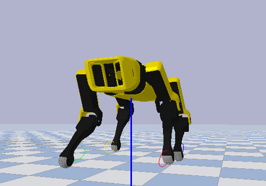
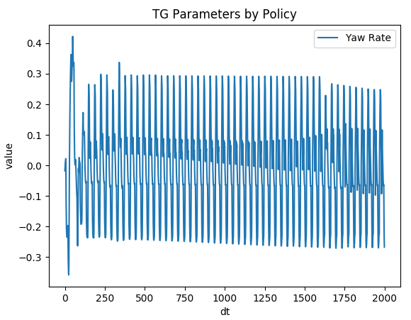
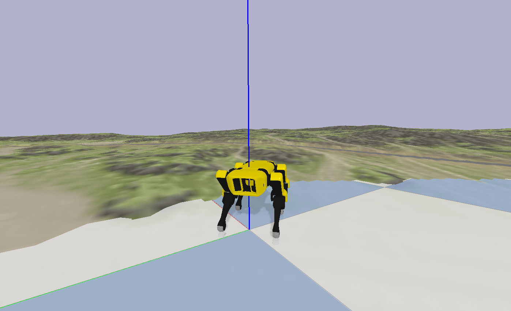
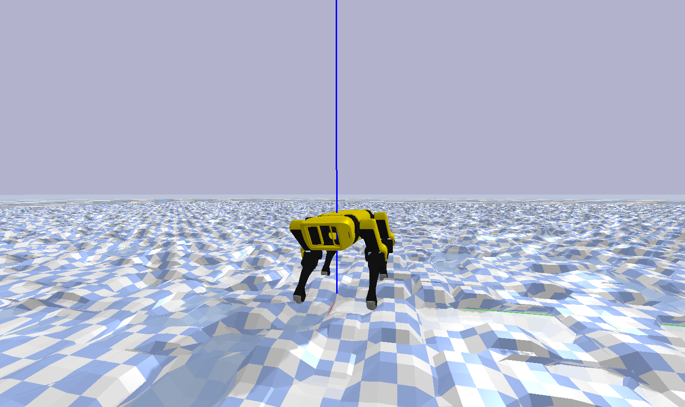

## Spot Mini Mini

### Kinematics and Gait:

Pybullet Environment and body manipulation with leg IK from: https://www.researchgate.net/publication/320307716_Inverse_Kinematic_Analysis_Of_A_Quadruped_Robot

Open-Loop Gait using 12-Point Bezier Curves based on: https://dspace.mit.edu/handle/1721.1/98270

Forward and Lateral Motion:

<!--  -->

Yaw logic based on 4-wheel steering car: http://www.inase.org/library/2014/santorini/bypaper/ROBCIRC/ROBCIRC-54.pdf

<!--  -->

### Controls
Assuming you have a Logitech Gamepad F310:

`A`: switch between stepping and RPY

`X`: E-STOP (engage and disengage)

**Stepping Mode**:

* `Right Stick Up/Down`: Step Length
* `Right Stick Left/Right`: Lateral Fraction
* `Left Stick Up/Down`: Robot Height
* `Left Stick Left/Right`: Yaw Rate
* `Arrow Pad Up/Down` (DISCRETE): Step Height
* `Arrow Pad Left/Right` (DISCRETE): Step Depth
* `Bottom Right/Left Bumpers`: Step Velocity (modulate)
* `Top Right/Left Bumpers`: reset all to default

**Viewing Mode**:

* `Right Stick Up/Down`: Pitch
* `Right Stick Left/Right`: Roll
* `Left Stick Up/Down`: Robot Height
* `Left Stick Left/Right`: Yaw

Changing `Step Velocity` while moving forward:

Changing `Step Length` while moving forward:

Yaw In Place: Slightly push the `Right Stick` forward while pushing the `Left Stick` maximally in either direction:

### Reinforcement Learning
I've found that the Bezier Curve gait lends itself well to optimization via RL. Notice that the open-loop forward command drifts significantly over time (rougly 1m per 2m forward):

With a one-dimensional action space [`Yaw Rate`], and a 16-dimensional observation space [`IMU Inputs` (8), `Leg Phases` (4), `Leg Contacts` (4)], an `Augmented Random Search` agent (linear) was able to correct the trajectory after 299 epochs:

Here is the policy output for this demo. It's clearly biased on one end to account for Spot's drift:

## How To Run

### Dependencies
* ROS Melodic
* Gazebo
* Pytorch
* Pybullet
* Gym
* OpenCV

### Control:
First, you're going to need a joystick (okay, not really, but it's more fun if you have one).

**Setting Up The Joystick:**
* Get Number (you will see something like jsX): `ls /dev/input/`
* Make available to ROS: `sudo chmod a+rw /dev/input/jsX`
* Make sure `<param name="dev" type="string" value="/dev/input/jsX"/>` matches your setup in the launchfile

Then simply: `roslaunch mini_ros spot_move.launch`

You can ignore this msg: `[ERROR] [1591631380.406690714]: Couldn't open joystick force feedback!` It just means your controller is missing some functionality, but this package doesn't use it.

**Non-Joystick Use**

If you don't have a joystick, go to `spot_bullet/src` and do `./env_tester.py`. A Pybullet sim will open up for you with the same controls you would have on the joystick, except each is on its own scrollbar.

**Using Different Terrain**

Navigate to `spotmicro/heightfield.py` and take a look at `useProgrammatic` and `useTerrainFromPNG` (you can play around with the mesh scales for each) to experiment with different terrains. Make sure that the `spotBezierEnv` instance has `height_field=True` in `env_tester.py` and `spot_pybullet_interface` depending on whether you're using the joystick/ROS version. The same goes for the RL environments. Note: these were adapted from the `pybullet` source code.

`useTerrainFromPNG`

`useProgrammatic`

With this terrain type, I programmed in a randomizer that triggers upon reset. This, along with the body randomizer from `Pybullet's Minitaur` increases your RL Policy's robustness.

#### Reinforcement Learning
Go to `spot_bullet/src` and do `./spot_ars_eval.py`. When prompted, enter `299`. That's the best policy I have. Although, I have since modified the Bezier gait generator, so you might want to `git revert` to this commit: `96e2fb948947bcac2720e3ac01c65c19edbf308e`.

Make sure you switch to `spot_forward` for the most up-to-date RL environment which includes the body and terrain randomizer. Once this project is complete, I will merge this branch into `spot`, which is the main branch.

