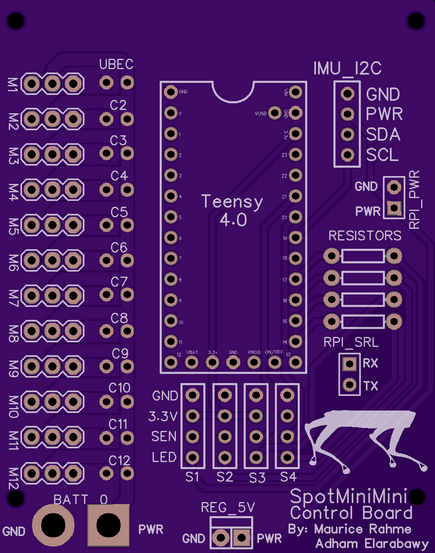

## Spot Micro Power Distribution Board
[Adham Elarabawy](https://github.com/adham-elarabawy/OpenQuadruped/blob/master/README.md) and I designed this Power Distribution Board for the [Spot Micro](https://spotmicroai.readthedocs.io/en/latest/). There are two available versions, one that supports a single power supply (mine), and one that supports dual power supplies (his). The second version exists because users who do not use HV servos will need UBECs to buck the 2S Lipo's voltage down to whatever their motors require. In general, these UBECs come with limited current support, which means that two of them are requrired.

This power distribution board has a `1.5mm Track Width` to support up to `5.5A` at a `10C` temperature increase (conservative estimate). There are also copper grounding planes on both sides of the board to help with heat dissipation, and parallel tracks for the power lines are provided for the same reason. The PDB also includes shunt capactiors for each servo motor to smooth out the power input. You are free to select your own capaciors as recommendations range from `100uF` to `470uF` depending on the motors. Make sure you use electrolytic capacitors.

This board interfaces with a sensor array (used for foot sensors on this project) and contains two  I2C terminals and a regulated 5V power rail. At the center of the board is a Teensy 4.0 which communicates with a Raspberry Pi over Serial to control the 12 servo motors and read the analogue sensors. The Teensy allows for motor speed control, but if you don't need this, it defaults at 100deg/sec (you can change this). The Gerber files for the single supply version are in this directory.